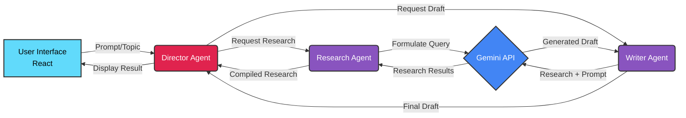

# 📚 BookAgent: Co-Creating the Future of Textbooks 

<!-- Typing SVG -->

 

<!-- Banner GIF -->

---

## 
🔮 Vision: The AI Co-Pilot for Textbook Creation 🔮

**BookAgent** is architected as a sophisticated **Multi-Agent System**, leveraging **Google Gemini**, designed not just to assist, but to *collaborate* with educators and authors in crafting exceptional, pedagogically-optimized learning materials. We aim to fuse human insight with AI scale.

**Core Objectives:**

1.  **⚡ Accelerate:** Radically shorten the textbook development lifecycle.
2.  **🧠 Enhance:** Embed pedagogical intelligence and validation from the start.
3.  **🤝 Collaborate:** Create a seamless fusion of human creativity and AI capability.
4.  **🎯 Adapt:** Build the foundation for truly personalized educational content.

---

## 
🚀 Architecture & Core Features 🚀

<table><tr><td valign="top" width="50%">

### 🤖 Multi-Agent System

- **Director:** Orchestrates the workflow.
- **Research:** Gathers and synthesizes information.
- **Writer:** Drafts content based on research and prompts.
- **Editor (Phase 2):** Refines style, tone, and coherence.
- **Fact-Checker (Phase 2):** Validates claims using RAG.
- **Pedagogy (Phase 2):** Optimizes for learning objectives.

</td><td valign="top" width="50%">

### ✨ Key Capabilities

- **Gemini 1.5 Pro:** State-of-the-art AI via Vertex AI.
- **RAG:** Grounding generation in facts & **user docs** (P2).
- **Pedagogical Optimization:** AI focused on *how* to teach.
- **Collaborative UI:** Designed for iterative human-AI interaction.
- **Extensible Framework:** Modular design for future agents.

</td></tr></table>

### Phase 1 Workflow

---

## 
🛠️ Tech Arsenal 🛠️

**Core Stack**

**AI & Cloud**

 <!-- Using GCP logo -->

---

## 
🧭 Project Status & Roadmap 🧭

Currently navigating **Phase 1: Foundational Framework & Core Generation**.

➡️ **Track our progress via the [Project Roadmap](./documentation/BookAgent_Roadmap.md)**

---

## 
📄 Core Documentation Vault 📄

Explore the blueprints of BookAgent:

*   [Technical Implementation Details](./documentation/technical_implementation.md)
*   [Multi-Agent System Design](./documentation/book_development_system.md)
*   [UI/UX Principles](./documentation/UI_UX_Principles.md)
*   [Workflow & Processes](./documentation/workflow_and_processes.md)
*   [Gemini API Development Plan](./documentation/gemini_api_development_plan.md)
*   [Ethical Considerations](./documentation/Ethical_Considerations.md)

---

## 
🏁 Setup & Launch (Coming Soon) 🏁

*(Detailed instructions for setting up the development environment and running the application will be added here once the initial scaffolding is complete and tested.)*

---

## 
🤝 Contributing 🤝

*(Contribution guidelines (`CONTRIBUTING.md`) are under development.)*

---

## 
📜 License 📜

Licensed under the MIT License. See `LICENSE` file (to be created).

---

<em>An Innovation by SquizAI</em> ⚡

