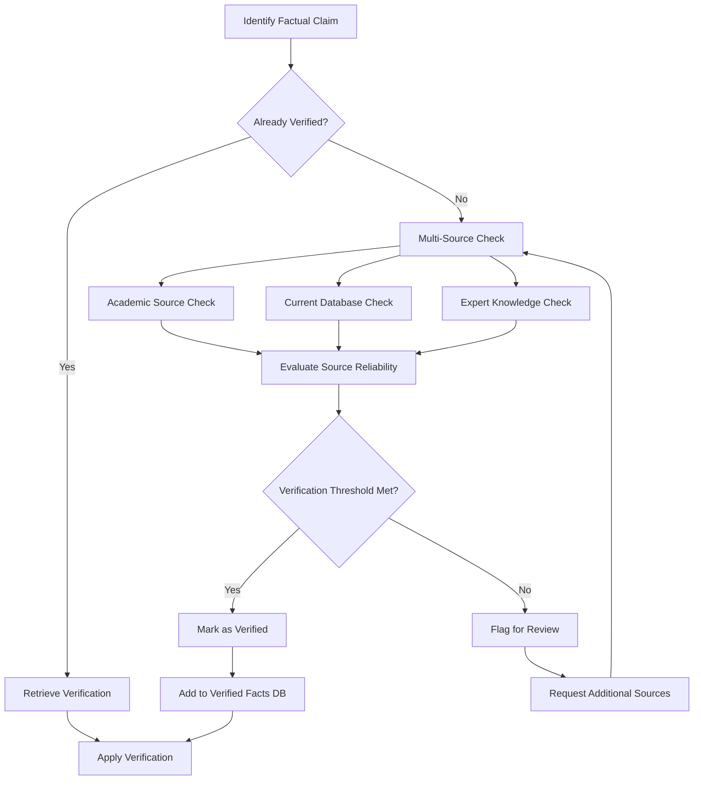

# Book Development Workflow and Processes

## Project Lifecycle Overview

The book development process follows a structured workflow that ensures quality, accuracy, and pedagogical effectiveness at every stage.

### 1. Project Initialization

1. **Syllabus Intake**
   - Upload syllabus document
   - Extract curriculum requirements
   - Identify state certification standards
   - Map learning objectives

2. **Professor Consultation**
   - Conduct initial interview
   - Identify content priorities
   - Establish depth preferences
   - Document teaching approaches

3. **Project Planning**
   - Create chapter allocation
   - Establish timeline
   - Define quality standards
   - Set up project tracking

### 2. Chapter Development Process

Each chapter follows this standardized development process:

#### Research Phase (2-3 weeks)
- Topic exploration and boundary definition
- Source identification and verification
- Case study collection and evaluation
- Knowledge base construction

#### Content Planning (1 week)
- Learning objective refinement
- Content depth mapping
- Example and application selection
- Visual element planning

#### Content Creation (2-3 weeks)
- Section drafting
- Example development
- Visual creation
- Assessment development

#### Review and Refinement (1-2 weeks)
- Fact-checking
- Pedagogical evaluation
- Professor review
- Content revision

#### Finalization (1 week)
- Formatting and layout
- Reference verification
- Final quality check
- Delivery preparation

## Agent Collaboration Patterns

### Sequential Processing

```
┌─────────────┐    ┌─────────────┐    ┌─────────────┐    ┌─────────────┐
│  Research   │───>│   Writer    │───>│    Editor   │───>│ Fact-Checker│
│    Agent    │    │    Agent    │    │    Agent    │    │    Agent    │
└─────────────┘    └─────────────┘    └─────────────┘    └─────────────┘
                                                                │
┌─────────────┐    ┌─────────────┐    ┌─────────────┐          │
│  Director   │<───│  Pedagogy   │<───│   Visual    │<─────────┘
│    Agent    │    │    Agent    │    │    Agent    │
└─────────────┘    └─────────────┘    └─────────────┘
```

### Parallel Processing

```
                         ┌─────────────┐
                         │  Director   │
                         │    Agent    │
                         └──────┬──────┘
                                │
                 ┌──────────────┼──────────────┐
                 │              │              │
         ┌───────▼─────┐ ┌──────▼──────┐ ┌─────▼───────┐
         │  Research   │ │   Writer    │ │    Editor   │
         │    Agent    │ │    Agent    │ │    Agent    │
         └───────┬─────┘ └──────┬──────┘ └─────┬───────┘
                 │              │              │
                 └──────────────┼──────────────┘
                                │
                         ┌──────▼──────┐
                         │  Director   │
                         │    Agent    │
                         └─────────────┘
```

### Consultation Pattern

```
                         ┌─────────────┐
                         │  Professor  │
                         │ Interaction │
                         └──────┬──────┘
                                │
                 ┌──────────────┼──────────────┐
                 │              │              │
         ┌───────▼─────┐ ┌──────▼──────┐ ┌─────▼───────┐
         │  Research   │ │    Writer   │ │   Pedagogy  │
         │    Agent    │ │    Agent    │ │    Agent    │
         └─────────────┘ └─────────────┘ └─────────────┘
```

## Quality Assurance Processes

### 1. Factual Verification Process



### 2. Content Depth Evaluation

Each topic and subtopic undergoes depth evaluation based on:

1. **Curriculum Requirements**
   - State certification standards
   - Program-specific requirements
   - Accreditation needs

2. **Professor Weighting**
   - Topic importance ratings (1-10)
   - Depth preference indicators
   - Time allocation recommendations

3. **Student Learning Needs**
   - Complexity of concept
   - Prerequisite knowledge
   - Application importance
   - Common misconceptions

4. **Depth Metrics**
   - Word count ranges by importance level
   - Example count by complexity
   - Visual support requirements
   - Assessment depth indicators

### 3. Pedagogical Effectiveness Review

Each chapter undergoes evaluation against these criteria:

1. **Clarity and Accessibility**
   - Reading level appropriateness
   - Technical term introduction
   - Concept explanation quality
   - Logical progression

2. **Engagement and Relevance**
   - Real-world connections
   - Student interest alignment
   - Narrative elements
   - Question prompts

3. **Learning Support**
   - Scaffolding quality
   - Example progression
   - Visual reinforcement
   - Knowledge check placement

4. **Assessment Alignment**
   - Learning objective coverage
   - Cognitive level distribution
   - Application focus
   - Feedback opportunities

## Implementation Milestones

### Phase 1: Foundation (Weeks 1-4)
- Set up agent architecture
- Develop syllabus parsing system
- Create professor interaction interface
- Establish knowledge database

### Phase 2: Core Functionality (Weeks 5-8)
- Implement research orchestration
- Develop content generation pipeline
- Create basic quality assurance processes
- Build initial chapter templates

### Phase 3: Enhancement (Weeks 9-12)
- Add visual content generation
- Implement advanced fact-checking
- Develop pedagogical evaluation
- Create assessment generation

### Phase 4: Integration (Weeks 13-16)
- Connect all system components
- Implement workflow management
- Develop monitoring and reporting
- Create user interfaces

### Phase 5: Testing and Refinement (Weeks 17-20)
- Conduct system testing
- Perform user acceptance testing
- Implement feedback and refinements
- Prepare for production deployment

## Phase 1: Basic Content Generation Workflow

This section outlines the simplified initial workflow for generating a draft content section using the foundational agents (Director, Research, Writer) as defined for Phase 1 in the [BookAgent_Roadmap.md](./BookAgent_Roadmap.md).

**Goal:** Generate a first draft of a book section based on a user-provided topic or prompt.

**Actors:**
*   **User:** Provides the initial input (topic, desired length/scope).
*   **Director Agent:** Orchestrates the workflow, delegates tasks.
*   **Research Agent:** Gathers information relevant to the topic using Gemini.
*   **Writer Agent:** Drafts the content based on research using Gemini.

**Steps:**

1.  **User Input:** 
    *   The user accesses the BookAgent interface (specific UI TBD, see [UI_UX_Principles.md](./UI_UX_Principles.md)).
    *   The user provides a topic or specific prompt for the desired content section (e.g., "Explain cellular respiration for high school biology, focus on glycolysis").
    *   The user might specify basic parameters like approximate length or key points to include.

2.  **Task Initiation (Director Agent):**
    *   The user input is received by the Director Agent.
    *   The Director Agent logs the request and initiates the generation process.
    *   The Director Agent tasks the Research Agent with gathering information on the specified topic.

3.  **Research Phase (Research Agent):**
    *   The Research Agent receives the topic and parameters from the Director.
    *   It formulates appropriate search queries or prompts for the Gemini API based on the topic.
    *   It executes the queries via the Gemini API (Ref: [technical_implementation.md](./technical_implementation.md)#3-Basic-Gemini-API-Integration).
    *   It processes the raw research results, potentially summarizing or extracting key information relevant to the user's prompt.
    *   The Research Agent sends the compiled research material back to the Director Agent.

4.  **Drafting Phase Initiation (Director Agent):**
    *   The Director Agent receives the research material.
    *   It tasks the Writer Agent with drafting the content section based on the provided research and the original user prompt/parameters.

5.  **Drafting Phase (Writer Agent):**
    *   The Writer Agent receives the research material and original prompt.
    *   It formulates a prompt for the Gemini API, instructing it to write a coherent section incorporating the research, adhering to the requested topic, scope, and potentially style (though style control will be basic in Phase 1).
    *   It executes the drafting request via the Gemini API.
    *   It receives the generated draft text.
    *   The Writer Agent may perform minimal formatting or cleanup.
    *   The Writer Agent sends the final draft text back to the Director Agent.

6.  **Output to User (Director Agent):**
    *   The Director Agent receives the final draft.
    *   It makes the draft available to the user through the interface.
    *   The workflow for this phase concludes. (Editing, revision, and more complex validation are planned for later phases).

**Assumptions/Limitations in Phase 1:**
*   Workflow is largely linear.
*   Limited error handling or recovery loops.
*   Minimal content validation beyond basic generation.
*   No sophisticated editing or feedback mechanisms.
*   Simple UI for input/output.
